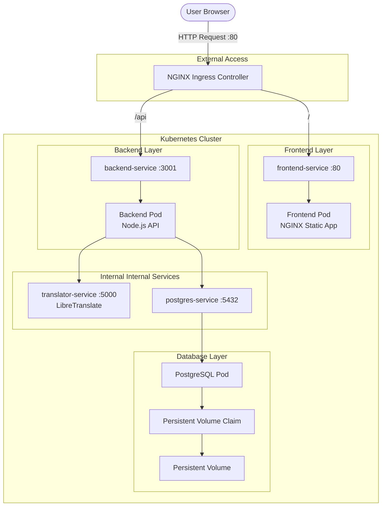
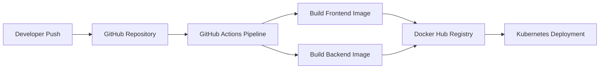

# App Translator - DevOps Project

A production-style microservices translation platform built with Kubernetes, Docker, Helm, Terraform, and CI/CD automation.

---

# Project Overview

This project demonstrates a complete DevOps workflow for deploying and managing a scalable microservices application inside Kubernetes.

The system includes:

- Frontend application
- Backend API
- Translation engine service
- PostgreSQL database
- Kubernetes networking
- Persistent storage
- Infrastructure as Code
- CI/CD automation

---

# Full Architecture



---

# CI/CD Pipeline



---

# Infrastructure as Code

Infrastructure provisioning and application deployment are fully managed using Terraform and Helm.

## Terraform Responsibilities

- Kubernetes namespace provisioning
- Helm release deployment
- Infrastructure consistency
- Automated environment setup
- Declarative infrastructure management

---

# Kubernetes Components

| Component | Purpose |
|---|---|
| Deployment | Manages Pods lifecycle |
| Service | Internal networking between services |
| Ingress | External HTTP routing |
| PVC/PV | Persistent database storage |
| Configurations | Environment variable management |
| Helm | Kubernetes package management |

---

# Application Components

---

## Frontend

### Responsibilities

- User interface
- Sends translation requests
- Displays translation results

### Technologies

- HTML / JavaScript
- NGINX
- Docker

---

## Backend API

### Responsibilities

- Handles API requests
- Connects frontend to translator service
- Stores translation history

### Technologies

- Node.js
- Express
- Docker

---

## Translation Service

### Responsibilities

- Performs text translations
- Exposes translation API internally

### Technologies

- LibreTranslate

---

## Database

### Responsibilities

- Stores translation history
- Provides persistent data storage

### Technologies

- PostgreSQL
- Kubernetes Persistent Volumes

---

# System Flow

## Request Lifecycle

### Step 1
User accesses the application through the NGINX Ingress Controller.

### Step 2
Ingress routes requests to the appropriate Kubernetes Service.

### Step 3
Frontend sends API requests to the Backend service.

### Step 4
Backend communicates with:
- LibreTranslate service
- PostgreSQL database

### Step 5
Translation result is returned to the frontend.

### Step 6
Translation history is saved in PostgreSQL.

---

# DevOps Features

- Kubernetes microservices architecture
- Internal Kubernetes DNS communication
- Infrastructure as Code using Terraform
- Helm-based deployments
- CI/CD automation with GitHub Actions
- Persistent storage management
- Containerized services using Docker
- Production-style networking architecture
- Scalable service design

---

# Challenges & Solutions

| Challenge | Solution |
|---|---|
| Service communication between pods | Used Kubernetes Services & internal DNS |
| Database persistence after pod recreation | Implemented PV & PVC |
| CI/CD automation | Built GitHub Actions pipeline |
| External traffic routing | Configured NGINX Ingress Controller |
| Multi-service deployment complexity | Managed deployments with Helm |

---

# Project Structure

```bash
app-translator/
│
├── backend/
│
├── frontend/
│
├── k8s/
│
├── helm/
│   └── app-translator/
│
├── terraform/
│
├── .github/
│   └── workflows/
│
├── docker-compose.yml
│
├── architecture.png
│
└── README.md
```

---

# Technologies Used

## Containerization
- Docker

## Orchestration
- Kubernetes
- Helm

## Infrastructure
- Terraform

## CI/CD
- GitHub Actions

## Backend
- Node.js
- Express

## Database
- PostgreSQL

## Networking
- NGINX Ingress Controller

## Translation Engine
- LibreTranslate

---

# Deployment

---

## Start Minikube

```bash
minikube start
```

---

## Enable Ingress

```bash
minikube addons enable ingress
```

---

## Terraform Deployment

```bash
cd terraform

terraform init

terraform apply -auto-approve
```

---

## Helm Deployment

```bash
cd helm/app-translator

helm dependency build

helm install app-translator .
```

---

# Access Application

Add local DNS mapping:

```bash
echo "$(minikube ip) translator.local" | sudo tee -a /etc/hosts
```

Open browser:

```bash
http://translator.local
```

---

# Key Learnings

- Kubernetes networking and service discovery
- Persistent storage management
- Microservices deployment strategies
- Infrastructure as Code principles
- CI/CD automation
- Helm chart packaging
- Kubernetes Ingress configuration
- Production-style DevOps workflows

---

# Future Improvements

- Deploy to AWS EKS
- Add monitoring with Prometheus & Grafana
- Add centralized logging with ELK Stack
- Add Horizontal Pod Autoscaling
- Add security scanning in CI/CD
- Implement secrets management
- Add Kubernetes health checks

---

# Author

DevOps Engineer focused on building scalable, automated, and production-ready cloud-native systems.
